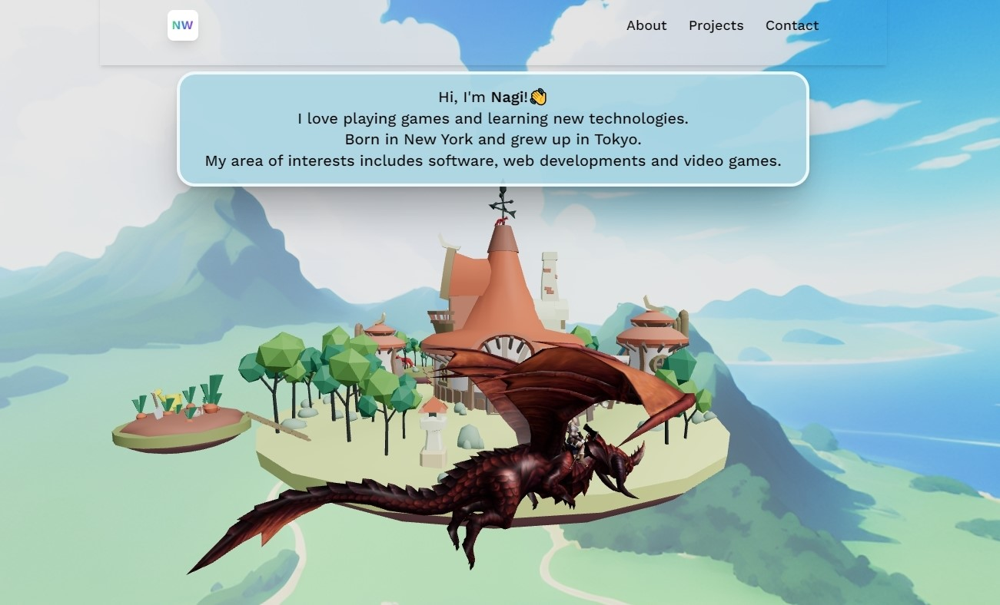

<div align="center">
  <br />
      
  <br />
  <div>
    
    
    
  </div>

  <h3 align="center">A 3D Developer Portfolio</h3>

   <div align="center">
     An interactive 3D portfolio website showcasing my projects and skills.
     Built this project step by step with a detailed tutorial on <a href="https://www.youtube.com/@javascriptmastery/videos" target="_blank"><b>JavaScript Mastery</b></a> YouTube.
    </div>
</div>


<!--  -->

## Table of Contents
- [Installation](#installation)
- [Technologies Used](#technologies-used)

## Installation

1. Clone the repository:
   ```sh
   git clone https://github.com/yourusername/nagi-3d-portfolio.git
   cd nagi-3d-portfolio

2. Install dependencies:
    ```sh
    npm install

3. Start the development server:
    ```sh
    npm run dev

## Technologies Used
- Next.js
- Three.js
- React
- TypeScript
- Tailwind CSS


